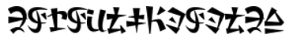

# ТЕКСТ и СИМВОЛЫ

__Стеганография__ - способ скрывать информацию так, чтобы о ее существовании никто не догадался.
Здесь вы узнаете где и как можно спрятать информацию, чтобы о ней не догадались.

Один из самых простых способов скрыть информацию являются _символы_. На первый взгляд обычный текст - но даже в нем можно спрятать данные так, что они не будут заметны невооруженным взглядом. 
___Unicode___ содержит тысячи символов, которые можно использовать по разному. Некоторые из них выглядят одинаково, но имеют разный код.
```
Например, латинская `a` и кириллическая `а` визуально почти неотличимы, но это разные символы.
```

---

Вот пример простого задания:
```
На этом изображении какие-то символы, я бы подумал что это на китайском и прошел мимо, но кажется там что-то спрятано, проверишь?
```



:::success
Если встретите интересные символы, то можно воспользоваться ___[сервисом](https://www.dcode.fr/)___ для расшифровки. Найдите шифр Hylian Language (Breath of the Wild) и узнайте что спрятано в файле.
:::

:::spoiler Ответ
Найдя нужный ___[шифр](https://www.dcode.fr/hylian-language-breath-of-the-wild)___ можно получить итоговое сообщение:
```
DOYOULIKEZELDA
```
:::